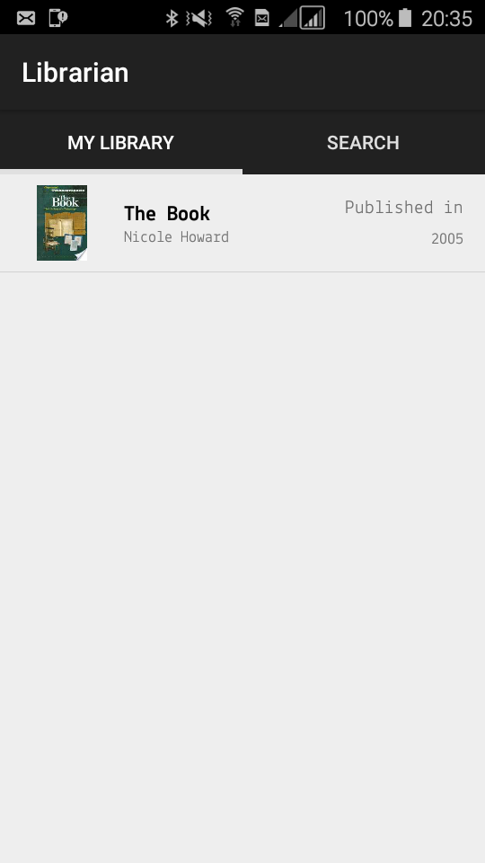

# Inventory app
Final project in udacity's android free course on data storage.
This app can be useful for someone who runs a store and wants to keep track of all his products.
## Screenshots
|   |   |   |   |
| - | - | - | - |
|  |  |  |  |
## Functionality
This app lets you search for books using Google Books apis. You can save books you searched for in a database 
Books saved in the database are displayed in "My library" tab, you can delete them anytime you want. 
Clicking a book, either from "My library" or "Search" tab will open a detail view that conains detailed information about the book,
as well as a button that opens up the browser for you to view the book online.
## Icons License

Icons made by <a href="http://www.freepik.com" title="Freepik">Freepik</a> from <a href="https://www.flaticon.com/" title="Flaticon">www.flaticon.com</a> is licensed by <a href="http://creativecommons.org/licenses/by/3.0/" title="Creative Commons BY 3.0" target="_blank">CC 3.0 BY</a>

